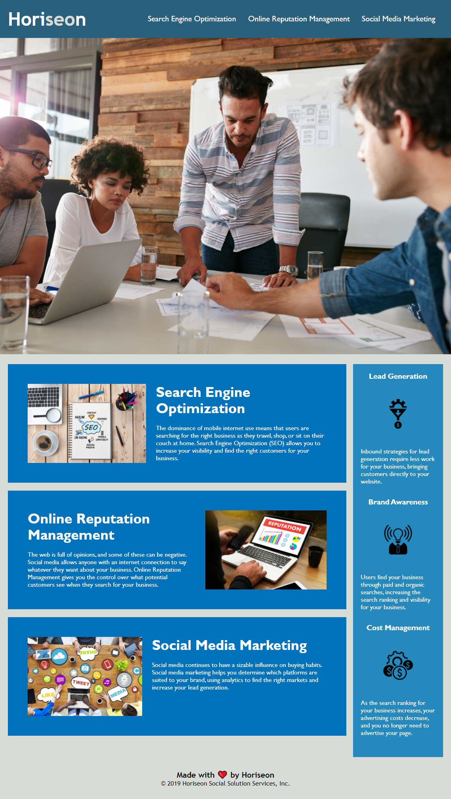

# 01 HTML, CSS, and Git: Code Refactor

## Description

Refactor code to increase web **accessibility** for a fictional marketing agency called Horiseon.

### Motivation

Accessibility centers user experience and technological innovation. As human interlocutors between humanity and technology, we consider both the technological readability of our code and the rich meaning conveyed by seemingly simple images. Does an image *mean* "an office table with people seated around it" or "engaged and inclusive collaboration?" What description maps to the meaning derived by a sighted person who experiences the image integrated into the story being told across the platform?

In order to communicate effectively, we need to consider our audience, whose sensory and mobility experiences may include assistive technology.  The decisions we make behind the scenes fundamentally effect other humans' experience of the story being told or service being offered and so should be carefully considered.    

### Learning Targets
This exercise required researching accessibility standards (WCAG), understanding the source code, writing semantic elements, consolidating redundant CSS, incorporating alt tags and aria-labels, and gaining experience uploading and publishing on GitHub.

I learned a good amount about HTML page structure and CSS layout, commenting out CSS, and using GitHub.

## Core Objectives Met

1. Source code updated with semantic HTML elements.
    - Div tags replaced with header, main, section, aside, and footer.
2. HTML elements structured logically.
    - Elements structured with with eye toward consistent hierarchical structure and CSS is consolidated.
3. Image elements updated with accessible alt attributes.
    - Alt attributes included and blank attributes +presentation role tags are applied to decorative images.
    - Emojis include aria labels.
4. Heading attributes follow sequential ordering.
    - Headings correspond to document structure related to importance of content, rather than size of text displayed.
5. Title element updated with descriptive title.
    - Title updated from "webpage" to more descriptive "Digital Marketing | Horiseon"

## Screen Shot

 

## Deployed Application

https://cailinbellwold.github.io/HTML-CSS-and-Git-Code-Refactor/
#